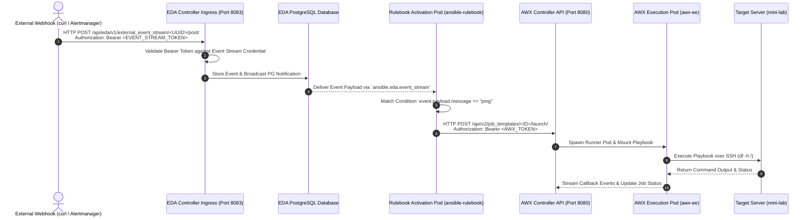
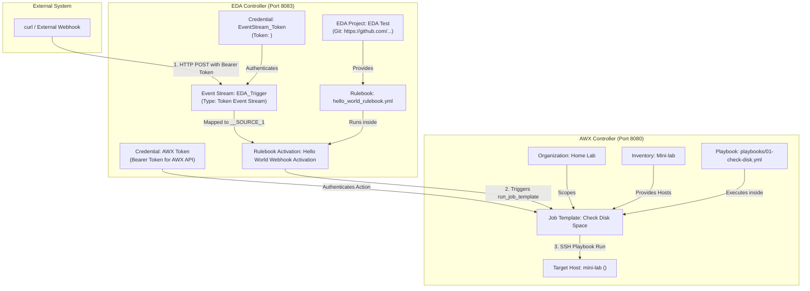

# Event-Driven Ansible (EDA) & AWX Integration Workflow Guide

This document provides a comprehensive architectural breakdown and step-by-step workflow guide for integrating **Event-Driven Ansible (EDA)** with **Ansible Automation Platform / AWX**. 

---

## 1. High-Level Architecture & Paradigm

Traditional Ansible automation is **pull/schedule-driven** or **manually launched** via AWX. **Event-Driven Ansible (EDA)** shifts automation to an **event-driven paradigm**: external systems emit webhook events (e.g., monitoring alerts, GitHub webhooks, ServiceNow tickets), EDA evaluates rules, and dispatches automated responses directly to AWX.

```
[ External System / Webhook ] ──( HTTP POST )──> [ EDA Controller ]
                                                      │
                                                      ▼
                                            [ ansible-rulebook ]
                                                      │
                                            ( Evaluates Rules )
                                                      │
                                                      ▼
[ Target Host ] <──( SSH / Playbook )── [ AWX Job Template ]
```

---

## 2. Core Objects & Component Glossary

### A. EDA Controller Objects

| Object | Location | Purpose |
| :--- | :--- | :--- |
| **Event Stream** | EDA UI $\rightarrow$ Event Streams | The HTTP endpoint (`http://<EDA-HOST>:8083/api/eda/v1/external_event_stream/<UUID>/post/`) that listens for incoming webhooks. |
| **Event Stream Credential** | EDA UI $\rightarrow$ Credentials | Type: `Token Event Stream`. Holds the token used to authenticate external HTTP POST requests via `Authorization: Bearer <TOKEN>`. |
| **AWX Controller Credential** | EDA UI $\rightarrow$ Credentials | Type: `Ansible Automation Platform`. Holds the AWX API token and URL allowing EDA to trigger Job Templates in AWX. |
| **Managed System Credential** (`_DEFAULT_EDA_PG_NOTIFY_CREDS`) | EDA PostgreSQL Database | Internal system credential holding database host, user, and password parameters so `ansible-rulebook` pods can receive PostgreSQL notifications (`ansible.eda.event_stream`). |
| **EDA Project** | EDA UI $\rightarrow$ Projects | Connects EDA Controller to a Git repository containing Ansible rulebooks (`rulebooks/*.yml`). |
| **Rulebook Activation** | EDA UI $\rightarrow$ Activations | Spawns a dedicated Kubernetes pod (`activation-job-1-XX`) running `ansible-rulebook`. Maps external Event Streams (`EDA_Trigger`) to rulebook sources (`__SOURCE_1`). |

---

### B. AWX Controller Objects

| Object | Location | Purpose |
| :--- | :--- | :--- |
| **Organization** | AWX UI $\rightarrow$ Organizations | Multi-tenant logical grouping for resources (e.g., `Home Lab`). |
| **Inventory** | AWX UI $\rightarrow$ Inventories | Collection of target hosts (e.g., `Mini-lab` host `<SERVER_IP>`). |
| **Machine Credential** | AWX UI $\rightarrow$ Credentials | SSH key or password used by AWX execution pods to connect to target hosts. |
| **Job Template** | AWX UI $\rightarrow$ Templates | Playbook execution definition combining Inventory, Project, Playbook, and Credentials (e.g., `Check Disk Space`). |
| **Execution Environment (EE)** | AWX UI $\rightarrow$ Execution Environments | Container image (`quay.io/ansible/awx-ee:24.6.1`) containing Ansible Core, collections, and Python libraries required to run playbooks. |

---

## 3. End-to-End Execution Sequence



---

## 4. Interconnected Object Mapping

The diagram below shows how credentials, projects, streams, and rulebooks link together across EDA and AWX:



---

## 5. Step-by-Step Configuration Walkthrough

### Step 1: Configure the Rulebook in Git (`rulebooks/hello_world_rulebook.yml`)

```yaml
---
- name: Hello World Event-Driven Ansible Rulebook
  hosts: all

  sources:
    - ansible.eda.event_stream:

  rules:
    - name: Trigger AWX Job Template on Ping Event
      condition: event.payload.message == "ping"
      action:
        run_job_template:
          name: "Check Disk Space"
          organization: "Home Lab"

    - name: Log Received Webhook Payload
      condition: event.payload.message is defined
      action:
        debug:
          msg: "Received event payload from webhook: {{ event.payload }}"
```

---

### Step 2: Configure Credentials in EDA Controller

1. **Event Stream Credential**:
   - Name: `EventStream_Token`
   - Credential Type: `Token Event Stream`
   - Secret Token: `<EVENT_STREAM_TOKEN>`

2. **AWX Token Credential**:
   - Name: `AWX Controller Token`
   - Credential Type: `Ansible Automation Platform`
   - Host: `http://awx-demo-service.awx.svc.cluster.local:80` (or `http://<SERVER_IP>:8080`)
   - Token: `<AWX-API-TOKEN>`

---

### Step 3: Configure Event Stream in EDA Controller

- Name: `EDA_Trigger`
- Event Stream Type: `Token Event Stream`
- Credential: `EventStream_Token`
- **Generated Endpoint URL**: `http://<SERVER_IP>:8083/api/eda/v1/external_event_stream/<EVENT_STREAM_UUID>/post/`

---

### Step 4: Create Rulebook Activation in EDA Controller

- Name: `Hello World Webhook Activation`
- Project: `EDA Test`
- Rulebook: `rulebooks/hello_world_rulebook.yml`
- Credential: `AWX Controller Token`
- **Variables / Event Stream Mapping**:
  - `__SOURCE_1` $\rightarrow$ `EDA_Trigger`

---

### Step 5: Trigger Event via `curl`

Execute from any terminal or monitoring webhook:

```bash
curl -X POST http://<SERVER_IP>:8083/api/eda/v1/external_event_stream/<EVENT_STREAM_UUID>/post/ \
  -H "Content-Type: application/json" \
  -H "Authorization: Bearer <EVENT_STREAM_TOKEN>" \
  -d '{"message": "ping"}'
```

---

## 6. Under-the-Hood Gotchas & Best Practices

1. **HTTP Authorization Header Format**:
   - Incoming webhooks to EDA **MUST** use `Authorization: Bearer <TOKEN>`.
   - Using `Token <TOKEN>` or raw string will result in `{"detail":"Token mismatch, check your token"}`.

2. **Trusted Proxy Settings**:
   - When calling EDA API directly without Red Hat Envoy proxy, `EDA_EVENT_STREAM_REQUIRE_TRUSTED_PROXY` must be set to `@bool false` in Dynaconf settings (`eda-instance.yaml`).

3. **PostgreSQL Database Credential (`_DEFAULT_EDA_PG_NOTIFY_CREDS`)**:
   - `ansible.eda.event_stream` uses PostgreSQL LISTEN/NOTIFY. The system credential `_DEFAULT_EDA_PG_NOTIFY_CREDS` in PostgreSQL must have `postgres_db_host: eda-demo-postgres-15` so worker pods inside Kubernetes can resolve the database hostname.

4. **Exact Object Name Matching**:
   - In rulebooks, `name` under `run_job_template` must **EXACTLY match** the Job Template name in AWX (e.g., `Check Disk Space`), and `organization` must match (e.g., `Home Lab`).
